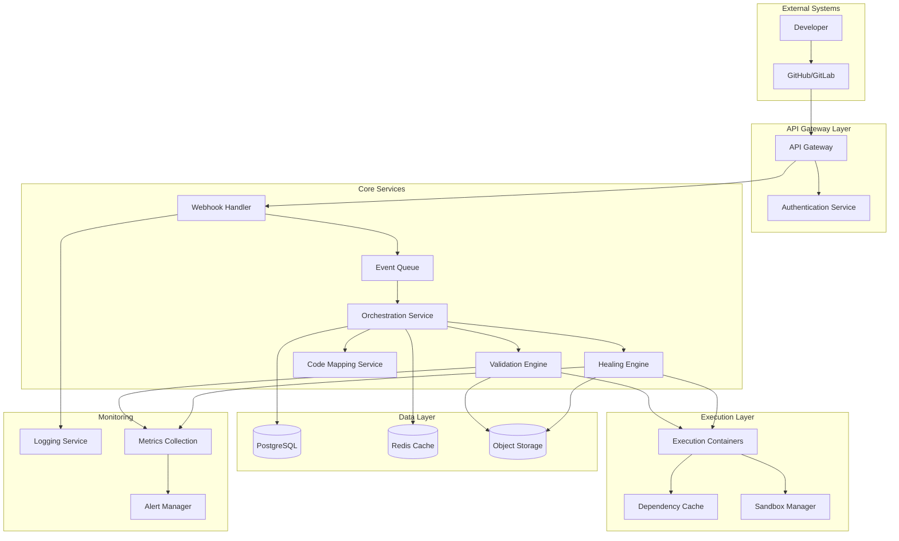

# Design Document: Self-Healing Documentation Engine

## Overview

The Self-Healing Documentation Engine is a cloud-native microservices architecture that integrates with GitHub and GitLab as a bot application. The system validates code snippets in documentation during pull request workflows, automatically corrects broken examples using AI, and maintains documentation accuracy as codebases evolve.

The architecture follows event-driven patterns with webhook processing, secure containerized code execution, and intelligent code-documentation mapping. The system prioritizes performance with parallel processing, caching strategies, and resource optimization to meet strict timing requirements (2 minutes for interpreted languages, 5 minutes for compiled languages).

## Architecture

### High-Level Architecture



### Service Architecture

**API Gateway Layer:**
- **API Gateway**: Routes requests, handles rate limiting, and provides unified entry point
- **Authentication Service**: Manages GitHub/GitLab app authentication and webhook signature validation

**Core Services:**
- **Webhook Handler**: Processes incoming webhook events, validates signatures, prevents recursion
- **Event Queue**: Manages event processing order, debouncing, and retry logic
- **Orchestration Service**: Coordinates validation workflows, manages state, handles PR interactions
- **Validation Engine**: Extracts and executes code snippets in isolated environments
- **Healing Engine**: AI-powered correction generation and validation of fixes
- **Code Mapping Service**: Maintains relationships between code and documentation

**Execution Layer:**
- **Execution Containers**: Isolated environments for running code snippets
- **Dependency Cache**: Caches language runtimes and common dependencies
- **Sandbox Manager**: Manages container lifecycle and resource limits

### Technology Stack

**Backend Services:**
- **Language**: TypeScript/Node.js for core services (fast development, good GitHub API support)
- **Runtime**: Docker containers on Kubernetes for scalability and isolation
- **API Framework**: Express.js with OpenAPI specification
- **Message Queue**: Redis with Bull queue for reliable event processing

**Code Execution:**
- **Container Runtime**: Docker with custom images for each supported language
- **Orchestration**: Kubernetes Jobs for dynamic container management
- **Security**: gVisor for additional container isolation
- **Languages Supported**: Python, JavaScript, TypeScript, Java, Go, Rust

**Data Storage:**
- **Primary Database**: PostgreSQL for transactional data and configuration
- **Cache**: Redis for session data, rate limiting, and temporary results
- **Object Storage**: AWS S3/MinIO for storing execution logs and large artifacts
- **Search**: Elasticsearch for code-documentation mapping and analytics

**Infrastructure:**
- **Cloud Platform**: AWS/GCP/Azure with Kubernetes (EKS/GKE/AKS)
- **CI/CD**: GitHub Actions for deployment pipeline
- **Monitoring**: Prometheus + Grafana for metrics, ELK stack for logging
- **Security**: Vault for secrets management, network policies for isolation

## Components and Interfaces

### Webhook Handler Service

**Responsibilities:**
- Receive and validate webhook events from GitHub/GitLab
- Prevent recursion by identifying bot-generated commits
- Queue events for processing with deduplication

**Key Interfaces:**
```typescript
interface WebhookEvent {
  source: 'github' | 'gitlab';
  type: 'pull_request' | 'push' | 'merge_request';
  repository: RepositoryInfo;
  pullRequest: PullRequestInfo;
  commits: CommitInfo[];
  signature: string;
}

interface WebhookHandler {
  validateSignature(payload: string, signature: string): boolean;
  isRecursiveEvent(event: WebhookEvent): boolean;
  queueEvent(event: WebhookEvent): Promise<void>;
}
```

### Validation Engine

**Responsibilities:**
- Extract code snippets from documentation files
- Execute snippets in isolated containers
- Collect execution results and error information

**Key Interfaces:**
```typescript
interface CodeSnippet {
  id: string;
  language: string;
  code: string;
  file: string;
  lineStart: number;
  lineEnd: number;
  dependencies?: string[];
}

interface ValidationResult {
  snippetId: string;
  success: boolean;
  output?: string;
  error?: ExecutionError;
  executionTime: number;
}

interface ValidationEngine {
  extractSnippets(files: DocumentationFile[]): CodeSnippet[];
  validateSnippet(snippet: CodeSnippet, context: CodeContext): Promise<ValidationResult>;
  validateBatch(snippets: CodeSnippet[]): Promise<ValidationResult[]>;
}
```

### Healing Engine

**Responsibilities:**
- Generate corrected versions of broken code snippets
- Use AI models to understand context and intent
- Validate corrections before applying

**Key Interfaces:**
```typescript
interface CorrectionRequest {
  snippet: CodeSnippet;
  error: ExecutionError;
  codeContext: CodeContext;
  documentationContext: string;
}

interface CorrectionResult {
  originalSnippet: CodeSnippet;
  correctedCode: string;
  confidence: number;
  explanation: string;
  validated: boolean;
}

interface HealingEngine {
  generateCorrection(request: CorrectionRequest): Promise<CorrectionResult>;
  validateCorrection(correction: CorrectionResult): Promise<boolean>;
}
```

### Code Mapping Service

**Responsibilities:**
- Maintain relationships between code symbols and documentation
- Track changes in code structure
- Provide context for validation and healing

**Key Interfaces:**
```typescript
interface CodeSymbol {
  name: string;
  type: 'function' | 'class' | 'interface' | 'variable';
  signature: string;
  file: string;
  line: number;
}

interface DocumentationReference {
  snippetId: string;
  symbols: CodeSymbol[];
  confidence: number;
}

interface CodeMappingService {
  analyzeCodebase(repository: RepositoryInfo): Promise<CodeSymbol[]>;
  mapDocumentationReferences(snippets: CodeSnippet[]): Promise<DocumentationReference[]>;
  trackSymbolChanges(oldSymbols: CodeSymbol[], newSymbols: CodeSymbol[]): SymbolChange[];
}
```

### Orchestration Service

**Responsibilities:**
- Coordinate validation workflows
- Manage PR status checks and comments
- Handle configuration and customization

**Key Interfaces:**
```typescript
interface ValidationWorkflow {
  pullRequestId: string;
  status: 'pending' | 'running' | 'completed' | 'failed';
  results: ValidationResult[];
  corrections: CorrectionResult[];
  startTime: Date;
  endTime?: Date;
}

interface OrchestrationService {
  processWebhookEvent(event: WebhookEvent): Promise<void>;
  runValidationWorkflow(pullRequest: PullRequestInfo): Promise<ValidationWorkflow>;
  applyCorrections(corrections: CorrectionResult[]): Promise<void>;
  updatePRStatus(pullRequest: PullRequestInfo, workflow: ValidationWorkflow): Promise<void>;
}
```

## Data Models

### Database Schema

**repositories table:**
```sql
CREATE TABLE repositories (
  id SERIAL PRIMARY KEY,
  platform VARCHAR(20) NOT NULL, -- 'github' or 'gitlab'
  owner VARCHAR(255) NOT NULL,
  name VARCHAR(255) NOT NULL,
  full_name VARCHAR(511) NOT NULL,
  installation_id BIGINT,
  config JSONB DEFAULT '{}',
  created_at TIMESTAMP DEFAULT NOW(),
  updated_at TIMESTAMP DEFAULT NOW(),
  UNIQUE(platform, full_name)
);
```

**pull_requests table:**
```sql
CREATE TABLE pull_requests (
  id SERIAL PRIMARY KEY,
  repository_id INTEGER REFERENCES repositories(id),
  pr_number INTEGER NOT NULL,
  pr_id BIGINT NOT NULL, -- GitHub/GitLab PR ID
  title VARCHAR(500),
  branch VARCHAR(255),
  base_branch VARCHAR(255),
  author VARCHAR(255),
  status VARCHAR(50) DEFAULT 'open',
  created_at TIMESTAMP DEFAULT NOW(),
  updated_at TIMESTAMP DEFAULT NOW(),
  UNIQUE(repository_id, pr_number)
);
```

**validation_workflows table:**
```sql
CREATE TABLE validation_workflows (
  id SERIAL PRIMARY KEY,
  pull_request_id INTEGER REFERENCES pull_requests(id),
  status VARCHAR(50) DEFAULT 'pending',
  total_snippets INTEGER DEFAULT 0,
  passed_snippets INTEGER DEFAULT 0,
  failed_snippets INTEGER DEFAULT 0,
  corrected_snippets INTEGER DEFAULT 0,
  execution_time_ms INTEGER,
  started_at TIMESTAMP DEFAULT NOW(),
  completed_at TIMESTAMP,
  error_message TEXT
);
```

**code_snippets table:**
```sql
CREATE TABLE code_snippets (
  id SERIAL PRIMARY KEY,
  workflow_id INTEGER REFERENCES validation_workflows(id),
  file_path VARCHAR(1000) NOT NULL,
  language VARCHAR(50) NOT NULL,
  line_start INTEGER NOT NULL,
  line_end INTEGER NOT NULL,
  original_code TEXT NOT NULL,
  corrected_code TEXT,
  validation_status VARCHAR(50) DEFAULT 'pending',
  execution_output TEXT,
  error_message TEXT,
  execution_time_ms INTEGER,
  created_at TIMESTAMP DEFAULT NOW()
);
```

**code_symbols table:**
```sql
CREATE TABLE code_symbols (
  id SERIAL PRIMARY KEY,
  repository_id INTEGER REFERENCES repositories(id),
  name VARCHAR(255) NOT NULL,
  type VARCHAR(50) NOT NULL,
  signature TEXT,
  file_path VARCHAR(1000) NOT NULL,
  line_number INTEGER,
  commit_sha VARCHAR(40),
  created_at TIMESTAMP DEFAULT NOW(),
  INDEX(repository_id, name, type)
);
```

**documentation_references table:**
```sql
CREATE TABLE documentation_references (
  id SERIAL PRIMARY KEY,
  snippet_id INTEGER REFERENCES code_snippets(id),
  symbol_id INTEGER REFERENCES code_symbols(id),
  confidence DECIMAL(3,2) DEFAULT 0.0,
  reference_type VARCHAR(50), -- 'direct', 'indirect', 'example'
  created_at TIMESTAMP DEFAULT NOW()
);
```

**webhook_events table:**
```sql
CREATE TABLE webhook_events (
  id SERIAL PRIMARY KEY,
  repository_id INTEGER REFERENCES repositories(id),
  event_type VARCHAR(100) NOT NULL,
  event_id VARCHAR(255), -- GitHub/GitLab event ID for deduplication
  payload JSONB NOT NULL,
  processed_at TIMESTAMP,
  status VARCHAR(50) DEFAULT 'pending',
  error_message TEXT,
  created_at TIMESTAMP DEFAULT NOW(),
  UNIQUE(repository_id, event_id)
);
```

### Configuration Schema

**Repository Configuration (stored in config JSONB field):**
```typescript
interface RepositoryConfig {
  enabled: boolean;
  documentationPaths: string[]; // glob patterns
  excludePaths: string[];
  languages: {
    [language: string]: {
      enabled: boolean;
      timeout: number; // seconds
      dependencies: string[];
      customSetup?: string;
    };
  };
  validation: {
    autoCorrect: boolean;
    requireManualReview: boolean;
    blockOnFailure: boolean;
  };
  notifications: {
    prComments: boolean;
    statusChecks: boolean;
    emailAlerts: boolean;
  };
}
```

### Cache Data Models

**Redis Cache Structures:**
```typescript
// Rate limiting
interface RateLimit {
  key: string; // repository:action
  count: number;
  resetTime: number;
}

// Dependency cache
interface DependencyCache {
  language: string;
  dependencies: string[];
  imageTag: string;
  lastUsed: Date;
  size: number;
}

// Execution results cache
interface ExecutionCache {
  codeHash: string;
  result: ValidationResult;
  ttl: number;
}
```

## Error Handling

### Error Classification

**System Errors:**
- Infrastructure failures (database, queue, containers)
- External service failures (GitHub/GitLab API)
- Resource exhaustion (memory, CPU, storage)

**Validation Errors:**
- Code execution failures (syntax, runtime errors)
- Dependency installation failures
- Timeout errors during execution

**Security Errors:**
- Invalid webhook signatures
- Unauthorized access attempts
- Container escape attempts

**Business Logic Errors:**
- Configuration validation failures
- Unsupported language/framework combinations
- Malformed documentation structures

### Error Handling Strategies

**Retry Logic:**
```typescript
interface RetryConfig {
  maxAttempts: number;
  backoffMultiplier: number;
  maxBackoffMs: number;
  retryableErrors: string[];
}

const defaultRetryConfig: RetryConfig = {
  maxAttempts: 3,
  backoffMultiplier: 2,
  maxBackoffMs: 30000,
  retryableErrors: ['TIMEOUT', 'NETWORK_ERROR', 'RATE_LIMITED']
};
```

**Circuit Breaker Pattern:**
- Protect external services (GitHub/GitLab APIs)
- Prevent cascade failures in validation pipeline
- Automatic recovery with health checks

**Graceful Degradation:**
- Continue processing other snippets when one fails
- Provide partial results when possible
- Fall back to manual review when auto-correction fails

**Error Recovery:**
- Automatic cleanup of failed containers
- Queue message reprocessing with exponential backoff
- Database transaction rollback on validation failures

### Monitoring and Alerting

**Key Metrics:**
- Validation success/failure rates by language
- Average execution time per language
- Auto-correction accuracy rates
- Webhook processing latency
- Container resource utilization

**Alert Conditions:**
- Validation failure rate > 50% for any language
- Average execution time exceeds SLA (2min/5min)
- Webhook processing backlog > 100 events
- Container resource usage > 80%
- Database connection pool exhaustion

## Testing Strategy

The testing strategy employs a dual approach combining unit tests for specific scenarios and property-based tests for comprehensive validation of universal system behaviors.

**Unit Testing Focus:**
- API endpoint validation with specific request/response examples
- Database operations with known data sets
- Error handling scenarios with controlled failure conditions
- Integration points between services with mock dependencies
- Security validation with known attack vectors

**Property-Based Testing Focus:**
- Code snippet extraction and validation across all supported languages
- Webhook event processing with generated event variations
- Auto-correction accuracy with diverse code examples
- Performance characteristics under varying load conditions
- Data consistency across concurrent operations

**Testing Infrastructure:**
- **Unit Tests**: Jest/Mocha with 90%+ code coverage requirement
- **Property Tests**: fast-check (JavaScript) with minimum 100 iterations per property
- **Integration Tests**: Docker Compose environments for service interaction testing
- **Load Tests**: k6 for performance validation under realistic traffic
- **Security Tests**: OWASP ZAP for vulnerability scanning

**Property Test Configuration:**
Each property test will run a minimum of 100 iterations to ensure comprehensive input coverage. Tests will be tagged with references to their corresponding design properties using the format: **Feature: ai-doc-healing, Property {number}: {property_text}**

**Test Environment Management:**
- Isolated test databases with automatic cleanup
- Mock GitHub/GitLab APIs for consistent testing
- Container registry with test-specific images
- Automated test data generation for realistic scenarios