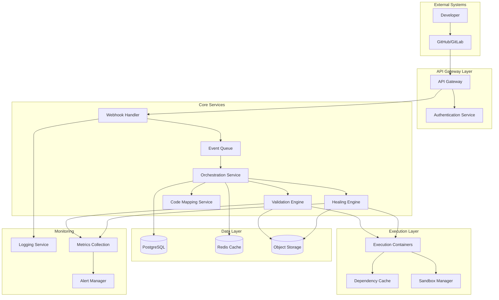

# Design Document: Self-Healing Documentation Engine

## Overview

The Self-Healing Documentation Engine is a cloud-native microservices architecture that integrates with GitHub and GitLab as a bot application. The system validates code snippets in documentation during pull request workflows, automatically corrects broken examples using AI, and maintains documentation accuracy as codebases evolve.

The architecture follows event-driven patterns with webhook processing, secure containerized code execution, and intelligent code-documentation mapping. The system prioritizes performance with parallel processing, caching strategies, and resource optimization to meet strict timing requirements (2 minutes for interpreted languages, 5 minutes for compiled languages).

**Design Rationale:** The microservices architecture enables independent scaling of compute-intensive validation tasks while maintaining a responsive webhook processing layer. This separation ensures that long-running code execution doesn't block webhook handling, preventing event loss during high-traffic periods.

## Architecture

### High-Level Architecture



### Service Architecture

**API Gateway Layer:**
- **API Gateway**: Routes requests, handles rate limiting, and provides unified entry point
- **Authentication Service**: Manages GitHub/GitLab app authentication and webhook signature validation

**Core Services:**
- **Webhook Handler**: Processes incoming webhook events, validates signatures, prevents recursion
- **Event Queue**: Manages event processing order, debouncing, and retry logic
- **Orchestration Service**: Coordinates validation workflows, manages state, handles PR interactions
- **Validation Engine**: Extracts and executes code snippets in isolated environments
- **Healing Engine**: AI-powered correction generation and validation of fixes
- **Code Mapping Service**: Maintains relationships between code and documentation

**Execution Layer:**
- **Execution Containers**: Isolated environments for running code snippets
- **Dependency Cache**: Caches language runtimes and common dependencies
- **Sandbox Manager**: Manages container lifecycle and resource limits

### Technology Stack

**Backend Services:**
- **Language**: Python 3.11+ for core services (excellent library ecosystem, GitHub API support via PyGithub)
- **Runtime**: Docker containers on Kubernetes for scalability and isolation
- **API Framework**: FastAPI with automatic OpenAPI documentation
- **Message Queue**: Redis with RQ (Redis Queue) for reliable event processing

**Code Execution:**
- **Container Runtime**: Docker with custom images for each supported language
- **Orchestration**: Kubernetes Jobs for dynamic container management
- **Security**: gVisor for additional container isolation
- **Languages Supported**: Python, JavaScript, TypeScript, Java, Go, Rust

**Data Storage:**
- **Primary Database**: PostgreSQL for transactional data and configuration
- **Cache**: Redis for session data, rate limiting, and temporary results
- **Object Storage**: AWS S3/MinIO for storing execution logs and large artifacts
- **Search**: Elasticsearch for code-documentation mapping and analytics

**Infrastructure:**
- **Cloud Platform**: AWS/GCP/Azure with Kubernetes (EKS/GKE/AKS)
- **CI/CD**: GitHub Actions for deployment pipeline
- **Monitoring**: Prometheus + Grafana for metrics, ELK stack for logging
- **Security**: Vault for secrets management, network policies for isolation

### GitHub and GitLab Integration

**GitHub App Configuration:**
- **Permissions Required:**
  - Repository contents: Read & Write (for reading docs and pushing corrections)
  - Pull requests: Read & Write (for status checks and comments)
  - Checks: Read & Write (for creating status checks)
  - Webhooks: Read (for receiving events)
  - Metadata: Read (for repository information)

- **Webhook Events:**
  - `pull_request` (opened, synchronize, reopened)
  - `push` (for tracking code changes)

**GitLab Integration Configuration:**
- **OAuth Scopes Required:**
  - `api` (full API access for repository operations)
  - `read_repository` (read repository contents)
  - `write_repository` (push corrections)

- **Webhook Events:**
  - Merge Request events
  - Push events

**Bot Installation Flow:**
1. User installs GitHub App or adds GitLab integration
2. User selects repositories to enable
3. System creates installation record with access token
4. System registers webhooks for selected repositories
5. System performs initial repository analysis (optional)
6. Bot posts welcome comment with configuration instructions

**Status Check Behavior:**
- **Check Name**: "Documentation Validation"
- **Pending State**: "Validating code snippets in documentation..."
- **Success State**: "All code snippets validated successfully (X/X passed)"
- **Failure State**: "Documentation validation failed (X/Y snippets failed)"
- **Details URL**: Links to validation report with error details

**Commit Message Format:**
```
[bot:doc-healing] Fix documentation snippets

Auto-corrected X code snippet(s) in:
- path/to/file1.md (line 45)
- path/to/file2.md (line 120)

Fixes detected by validation workflow #123
```

**Design Rationale:** The `[bot:doc-healing]` prefix enables reliable recursion detection across different bot authentication methods. Status checks block merging by default to enforce quality gates, but can be configured as advisory. The details URL provides transparency into validation logic and helps developers understand failures.

## Workflows

### Pull Request Validation Workflow

**Trigger:** Pull request opened or updated (new commits pushed)

**Process Flow:**
1. Webhook Handler receives PR event from GitHub/GitLab
2. Authentication Service validates webhook signature
3. Webhook Handler checks if event is bot-generated (recursion prevention)
4. Event Queue debounces rapid updates (30-second window)
5. Orchestration Service fetches changed documentation files
6. Validation Engine extracts code snippets from markdown files
7. Execution Containers run snippets in parallel with language-specific runtimes
8. Validation Engine collects results and error details
9. Orchestration Service creates PR status check (pass/fail)
10. Bot posts summary comment with validation results

**Design Rationale:** Debouncing prevents redundant validation when developers push multiple commits rapidly. Parallel execution of snippets maximizes throughput while respecting per-language timeout limits. Status checks block merging by default to enforce documentation quality gates.

### Auto-Correction Workflow

**Trigger:** Code snippet validation failure

**Process Flow:**
1. Healing Engine receives failed snippet with error details
2. Code Mapping Service provides context about referenced code symbols
3. Healing Engine generates correction using AI model with codebase context
4. Validation Engine re-validates corrected snippet in isolated container
5. If validation passes:
   - Orchestration Service creates commit on PR branch with corrected documentation
   - Bot identifies commit with special marker to prevent recursion
   - PR status check updates to reflect new validation state
6. If validation fails or confidence is low:
   - Bot creates review comment on specific documentation lines
   - Manual review flag added to PR

**Design Rationale:** Re-validation of corrections ensures AI-generated fixes are executable before committing. The confidence threshold (default 0.8) balances automation with safety. Bot commit markers use a consistent pattern (`[bot:doc-healing]` prefix) for reliable recursion detection.

### Code-Documentation Synchronization Workflow

**Trigger:** Code changes detected in PR

**Process Flow:**
1. Code Mapping Service analyzes diff to identify changed symbols
2. Service queries documentation_references table for affected snippets
3. For each affected snippet:
   - Validation Engine re-runs snippet with updated code context
   - If snippet fails, triggers Auto-Correction Workflow
4. Orchestration Service aggregates results across all affected documentation
5. Bot posts summary of documentation impact

**Design Rationale:** Proactive detection of documentation impact prevents stale examples from being merged. The mapping service uses AST analysis to track symbol renames and moves, providing higher accuracy than text-based search.

## Components and Interfaces

### Webhook Handler Service

**Responsibilities:**
- Receive and validate webhook events from GitHub/GitLab
- Prevent recursion by identifying bot-generated commits
- Queue events for processing with deduplication

**Key Interfaces:**
```python
from dataclasses import dataclass
from typing import Literal, List

@dataclass
class WebhookEvent:
    source: Literal['github', 'gitlab']
    type: Literal['pull_request', 'push', 'merge_request']
    repository: RepositoryInfo
    pull_request: PullRequestInfo
    commits: List[CommitInfo]
    signature: str

class WebhookHandler:
    def validate_signature(self, payload: str, signature: str) -> bool: ...
    def is_recursive_event(self, event: WebhookEvent) -> bool: ...
    async def queue_event(self, event: WebhookEvent) -> None: ...
```

### Validation Engine

**Responsibilities:**
- Extract code snippets from documentation files
- Execute snippets in isolated containers
- Collect execution results and error information
- Provide codebase context during execution
- Handle dependency installation with timeout limits

**Key Interfaces:**
```python
from dataclasses import dataclass
from typing import Optional, List, Literal
from enum import Enum

@dataclass
class CodeSnippet:
    id: str
    language: str
    code: str
    file: str
    line_start: int
    line_end: int
    dependencies: Optional[List[str]] = None

class ErrorType(Enum):
    SYNTAX = "syntax"
    RUNTIME = "runtime"
    TIMEOUT = "timeout"
    DEPENDENCY = "dependency"

@dataclass
class ExecutionError:
    type: ErrorType
    message: str
    line: Optional[int] = None
    stack_trace: Optional[str] = None

@dataclass
class ValidationResult:
    snippet_id: str
    success: bool
    output: Optional[str] = None
    error: Optional[ExecutionError] = None
    execution_time: float = 0.0

@dataclass
class CodeContext:
    repository_path: str
    branch: str
    commit_sha: str
    available_modules: List[str]

class ValidationEngine:
    def extract_snippets(self, files: List[DocumentationFile]) -> List[CodeSnippet]: ...
    async def validate_snippet(self, snippet: CodeSnippet, context: CodeContext) -> ValidationResult: ...
    async def validate_batch(self, snippets: List[CodeSnippet]) -> List[ValidationResult]: ...
    async def install_dependencies(self, language: str, dependencies: List[str], timeout: int) -> bool: ...
```

**Design Rationale:** The CodeContext interface enables snippets to reference project code, supporting realistic examples that import local modules. Dependency installation has explicit timeout limits (default 60 seconds) to prevent hanging on unavailable packages. The ExecutionError type classification enables targeted healing strategies.

### Healing Engine

**Responsibilities:**
- Generate corrected versions of broken code snippets
- Use AI models to understand context and intent
- Validate corrections before applying

**Key Interfaces:**
```python
@dataclass
class CorrectionRequest:
    snippet: CodeSnippet
    error: ExecutionError
    code_context: CodeContext
    documentation_context: str

@dataclass
class CorrectionResult:
    original_snippet: CodeSnippet
    corrected_code: str
    confidence: float
    explanation: str
    validated: bool

class HealingEngine:
    async def generate_correction(self, request: CorrectionRequest) -> CorrectionResult: ...
    async def validate_correction(self, correction: CorrectionResult) -> bool: ...
```

### Code Mapping Service

**Responsibilities:**
- Maintain relationships between code symbols and documentation
- Track changes in code structure
- Provide context for validation and healing
- Detect orphaned documentation and suggest updates
- Identify new public APIs for documentation

**Key Interfaces:**
```python
class SymbolType(Enum):
    FUNCTION = "function"
    CLASS = "class"
    INTERFACE = "interface"
    VARIABLE = "variable"

class Visibility(Enum):
    PUBLIC = "public"
    PRIVATE = "private"
    PROTECTED = "protected"

@dataclass
class CodeSymbol:
    name: str
    type: SymbolType
    signature: str
    file: str
    line: int
    visibility: Visibility

class ChangeType(Enum):
    RENAMED = "renamed"
    MOVED = "moved"
    DELETED = "deleted"
    SIGNATURE_CHANGED = "signature_changed"

@dataclass
class SymbolChange:
    type: ChangeType
    old_symbol: CodeSymbol
    new_symbol: Optional[CodeSymbol]
    affected_snippets: List[str]

class ReferenceType(Enum):
    DIRECT = "direct"
    INDIRECT = "indirect"
    EXAMPLE = "example"

@dataclass
class DocumentationReference:
    snippet_id: str
    symbols: List[CodeSymbol]
    confidence: float
    reference_type: ReferenceType

class CodeMappingService:
    async def analyze_codebase(self, repository: RepositoryInfo) -> List[CodeSymbol]: ...
    async def map_documentation_references(self, snippets: List[CodeSnippet]) -> List[DocumentationReference]: ...
    def track_symbol_changes(self, old_symbols: List[CodeSymbol], new_symbols: List[CodeSymbol]) -> List[SymbolChange]: ...
    async def find_orphaned_documentation(self, symbols: List[CodeSymbol]) -> List[CodeSnippet]: ...
    async def suggest_documentation_for_new_apis(self, symbols: List[CodeSymbol]) -> List[CodeSymbol]: ...
```

**Design Rationale:** The visibility field enables filtering for public APIs that require documentation. Semantic analysis uses AST parsing (tree-sitter for multi-language support) rather than regex to accurately track symbol changes. The confidence score helps prioritize manual review when mappings are ambiguous.

### Orchestration Service

**Responsibilities:**
- Coordinate validation workflows
- Manage PR status checks and comments
- Handle configuration and customization
- Create commits with auto-corrections
- Prevent webhook recursion loops

**Key Interfaces:**
```python
from datetime import datetime

class WorkflowStatus(Enum):
    PENDING = "pending"
    RUNNING = "running"
    COMPLETED = "completed"
    FAILED = "failed"

@dataclass
class ValidationWorkflow:
    pull_request_id: str
    status: WorkflowStatus
    results: List[ValidationResult]
    corrections: List[CorrectionResult]
    start_time: datetime
    end_time: Optional[datetime] = None

class StatusCheckStatus(Enum):
    PENDING = "pending"
    SUCCESS = "success"
    FAILURE = "failure"

@dataclass
class PRStatusCheck:
    name: str
    status: StatusCheckStatus
    conclusion: Optional[str]
    summary: str
    details_url: Optional[str] = None

@dataclass
class FileChange:
    path: str
    content: str

@dataclass
class BotCommit:
    message: str
    files: List[FileChange]
    branch: str
    marker: str  # '[bot:doc-healing]' prefix for recursion detection

class OrchestrationService:
    async def process_webhook_event(self, event: WebhookEvent) -> None: ...
    async def run_validation_workflow(self, pull_request: PullRequestInfo) -> ValidationWorkflow: ...
    async def apply_corrections(self, corrections: List[CorrectionResult]) -> BotCommit: ...
    async def update_pr_status(self, pull_request: PullRequestInfo, workflow: ValidationWorkflow) -> PRStatusCheck: ...
    async def post_pr_comment(self, pull_request: PullRequestInfo, summary: str) -> None: ...
    async def create_review_comment(self, pull_request: PullRequestInfo, file: str, line: int, message: str) -> None: ...
```

**Design Rationale:** The orchestration service centralizes PR interactions to ensure consistent commit message formatting and status check naming. The marker-based recursion detection is more reliable than author-based checks, which can fail with bot impersonation or shared accounts.

## Data Models

### Security and Execution Isolation

**Isolation Strategy:**

The system implements defense-in-depth for code execution security:

1. **Container Isolation:**
   - Each snippet executes in a fresh Docker container with no shared state
   - Containers use minimal base images (Alpine Linux) with only required language runtimes
   - gVisor provides additional kernel-level isolation to prevent container escape

2. **Network Restrictions:**
   - Execution containers have no network access to internal services
   - External network access limited to package registries (npm, PyPI, etc.) via egress proxy
   - Private repository code accessed via read-only volume mounts

3. **Resource Limits:**
   - CPU: 1 core per container (configurable per language)
   - Memory: 512MB default (2GB for compiled languages)
   - Execution timeout: 30 seconds default (configurable per language)
   - Disk: 1GB ephemeral storage, auto-cleaned after execution

4. **Secrets Protection:**
   - Environment variables cleared before snippet execution
   - No access to repository secrets or CI/CD credentials
   - Temporary credentials for package registries with read-only scope

5. **Audit and Monitoring:**
   - All execution attempts logged with snippet hash and repository context
   - Security violations (escape attempts, excessive resource usage) trigger alerts
   - Container logs retained for 30 days for forensic analysis

**Design Rationale:** The multi-layer approach ensures that even if one isolation mechanism fails, others prevent system compromise. gVisor adds minimal performance overhead (~10%) while significantly reducing kernel attack surface. Network restrictions prevent data exfiltration while allowing legitimate dependency installation.

## Data Models

### Database Schema

**repositories table:**
```sql
CREATE TABLE repositories (
  id SERIAL PRIMARY KEY,
  platform VARCHAR(20) NOT NULL, -- 'github' or 'gitlab'
  owner VARCHAR(255) NOT NULL,
  name VARCHAR(255) NOT NULL,
  full_name VARCHAR(511) NOT NULL,
  installation_id BIGINT,
  config JSONB DEFAULT '{}',
  created_at TIMESTAMP DEFAULT NOW(),
  updated_at TIMESTAMP DEFAULT NOW(),
  UNIQUE(platform, full_name)
);
```

**pull_requests table:**
```sql
CREATE TABLE pull_requests (
  id SERIAL PRIMARY KEY,
  repository_id INTEGER REFERENCES repositories(id),
  pr_number INTEGER NOT NULL,
  pr_id BIGINT NOT NULL, -- GitHub/GitLab PR ID
  title VARCHAR(500),
  branch VARCHAR(255),
  base_branch VARCHAR(255),
  author VARCHAR(255),
  status VARCHAR(50) DEFAULT 'open',
  created_at TIMESTAMP DEFAULT NOW(),
  updated_at TIMESTAMP DEFAULT NOW(),
  UNIQUE(repository_id, pr_number)
);
```

**validation_workflows table:**
```sql
CREATE TABLE validation_workflows (
  id SERIAL PRIMARY KEY,
  pull_request_id INTEGER REFERENCES pull_requests(id),
  status VARCHAR(50) DEFAULT 'pending',
  total_snippets INTEGER DEFAULT 0,
  passed_snippets INTEGER DEFAULT 0,
  failed_snippets INTEGER DEFAULT 0,
  corrected_snippets INTEGER DEFAULT 0,
  execution_time_ms INTEGER,
  started_at TIMESTAMP DEFAULT NOW(),
  completed_at TIMESTAMP,
  error_message TEXT
);
```

**code_snippets table:**
```sql
CREATE TABLE code_snippets (
  id SERIAL PRIMARY KEY,
  workflow_id INTEGER REFERENCES validation_workflows(id),
  file_path VARCHAR(1000) NOT NULL,
  language VARCHAR(50) NOT NULL,
  line_start INTEGER NOT NULL,
  line_end INTEGER NOT NULL,
  original_code TEXT NOT NULL,
  corrected_code TEXT,
  validation_status VARCHAR(50) DEFAULT 'pending',
  execution_output TEXT,
  error_message TEXT,
  execution_time_ms INTEGER,
  created_at TIMESTAMP DEFAULT NOW()
);
```

**code_symbols table:**
```sql
CREATE TABLE code_symbols (
  id SERIAL PRIMARY KEY,
  repository_id INTEGER REFERENCES repositories(id),
  name VARCHAR(255) NOT NULL,
  type VARCHAR(50) NOT NULL,
  signature TEXT,
  file_path VARCHAR(1000) NOT NULL,
  line_number INTEGER,
  commit_sha VARCHAR(40),
  created_at TIMESTAMP DEFAULT NOW(),
  INDEX(repository_id, name, type)
);
```

**documentation_references table:**
```sql
CREATE TABLE documentation_references (
  id SERIAL PRIMARY KEY,
  snippet_id INTEGER REFERENCES code_snippets(id),
  symbol_id INTEGER REFERENCES code_symbols(id),
  confidence DECIMAL(3,2) DEFAULT 0.0,
  reference_type VARCHAR(50), -- 'direct', 'indirect', 'example'
  created_at TIMESTAMP DEFAULT NOW()
);
```

**webhook_events table:**
```sql
CREATE TABLE webhook_events (
  id SERIAL PRIMARY KEY,
  repository_id INTEGER REFERENCES repositories(id),
  event_type VARCHAR(100) NOT NULL,
  event_id VARCHAR(255), -- GitHub/GitLab event ID for deduplication
  payload JSONB NOT NULL,
  processed_at TIMESTAMP,
  status VARCHAR(50) DEFAULT 'pending',
  error_message TEXT,
  created_at TIMESTAMP DEFAULT NOW(),
  UNIQUE(repository_id, event_id)
);
```

**validation_metrics table:**
```sql
CREATE TABLE validation_metrics (
  id SERIAL PRIMARY KEY,
  repository_id INTEGER REFERENCES repositories(id),
  workflow_id INTEGER REFERENCES validation_workflows(id),
  language VARCHAR(50) NOT NULL,
  total_snippets INTEGER NOT NULL,
  passed_snippets INTEGER NOT NULL,
  failed_snippets INTEGER NOT NULL,
  corrected_snippets INTEGER NOT NULL,
  average_execution_time_ms INTEGER,
  total_execution_time_ms INTEGER,
  created_at TIMESTAMP DEFAULT NOW(),
  INDEX(repository_id, created_at),
  INDEX(language, created_at)
);
```

**correction_metrics table:**
```sql
CREATE TABLE correction_metrics (
  id SERIAL PRIMARY KEY,
  repository_id INTEGER REFERENCES repositories(id),
  snippet_id INTEGER REFERENCES code_snippets(id),
  error_type VARCHAR(50) NOT NULL,
  correction_applied BOOLEAN DEFAULT false,
  confidence DECIMAL(3,2),
  validated BOOLEAN DEFAULT false,
  manual_review_required BOOLEAN DEFAULT false,
  accepted BOOLEAN, -- NULL until determined, true if not reverted
  created_at TIMESTAMP DEFAULT NOW(),
  INDEX(repository_id, created_at),
  INDEX(error_type, created_at)
);
```

**system_metrics table:**
```sql
CREATE TABLE system_metrics (
  id SERIAL PRIMARY KEY,
  webhook_queue_depth INTEGER,
  active_containers INTEGER,
  container_pool_utilization DECIMAL(5,2),
  database_connections INTEGER,
  api_rate_limit_remaining INTEGER,
  average_webhook_latency_ms INTEGER,
  created_at TIMESTAMP DEFAULT NOW(),
  INDEX(created_at)
);
```

### Configuration Schema

**Configuration File Location:**

The bot reads configuration from `.doc-healing.yml` in the repository root. If not present, defaults are used.

**Repository Configuration:**
```yaml
# .doc-healing.yml
enabled: true

# Documentation file patterns (glob syntax)
documentation:
  include:
    - "docs/**/*.md"
    - "README.md"
    - "*.mdx"
  exclude:
    - "docs/archive/**"
    - "__pycache__/**"
    - "venv/**"

# Language-specific settings
languages:
  python:
    enabled: true
    timeout: 30  # seconds
    dependencies:
      - "requests"
      - "pytest"
    customSetup: |
      pip install -r requirements.txt
  
  javascript:
    enabled: true
    timeout: 20
    dependencies:
      - "axios"
    customSetup: ""
  
  typescript:
    enabled: true
    timeout: 25
    dependencies: []
  
  java:
    enabled: true
    timeout: 60  # Longer for compilation
    dependencies: []
  
  go:
    enabled: true
    timeout: 45
    dependencies: []
  
  rust:
    enabled: true
    timeout: 90  # Longest for compilation
    dependencies: []

# Validation behavior
validation:
  autoCorrect: true
  confidenceThreshold: 0.8  # Minimum confidence for auto-correction
  requireManualReview: false  # Flag corrections for review even if validated
  blockOnFailure: true  # Block PR merging if validation fails
  parallelExecution: true
  maxConcurrentSnippets: 10

# Bot behavior
notifications:
  prComments: true  # Post summary comments
  statusChecks: true  # Create GitHub/GitLab status checks
  reviewComments: true  # Create line-specific review comments
  emailAlerts: false  # Email on validation failures

# Code snippet markers
snippetMarkers:
  codeBlockLanguages:
    - "python"
    - "javascript"
    - "typescript"
    - "java"
    - "go"
    - "rust"
  ignoreMarker: "<!-- doc-healing:ignore -->"  # Skip validation for marked snippets
```

**Configuration Storage (Database):**

The JSONB config field in the repositories table stores the parsed configuration:

```python
@dataclass
class DocumentationPaths:
    include: List[str]
    exclude: List[str]

@dataclass
class LanguageConfig:
    enabled: bool
    timeout: int
    dependencies: List[str]
    custom_setup: Optional[str] = None

@dataclass
class ValidationConfig:
    auto_correct: bool
    confidence_threshold: float
    require_manual_review: bool
    block_on_failure: bool
    parallel_execution: bool
    max_concurrent_snippets: int

@dataclass
class NotificationConfig:
    pr_comments: bool
    status_checks: bool
    review_comments: bool
    email_alerts: bool

@dataclass
class SnippetMarkers:
    code_block_languages: List[str]
    ignore_marker: str

@dataclass
class RepositoryConfig:
    enabled: bool
    documentation_paths: DocumentationPaths
    languages: Dict[str, LanguageConfig]
    validation: ValidationConfig
    notifications: NotificationConfig
    snippet_markers: SnippetMarkers
```

**Design Rationale:** YAML configuration provides a developer-friendly format with comments and multi-line strings for custom setup scripts. The ignore marker enables temporary validation skipping for known-broken examples during refactoring. Per-language timeouts accommodate compilation overhead while keeping interpreted languages fast.

### Performance Optimization

**Caching Strategy:**

1. **Dependency Cache:**
   - Pre-built Docker images with common dependencies for each language
   - Layer caching for faster container startup (reduces cold start from 30s to 5s)
   - Shared volume mounts for language runtimes across containers

2. **Execution Results Cache:**
   - Cache validation results by code snippet hash (SHA-256)
   - TTL: 24 hours for successful validations, 1 hour for failures
   - Invalidate cache when referenced code symbols change

3. **Code Mapping Cache:**
   - Cache AST analysis results per commit SHA
   - Incremental updates for changed files only
   - Redis storage with 7-day TTL

**Parallel Processing:**

- Snippet validation runs in parallel with configurable concurrency (default: 10)
- Language-specific worker pools to optimize resource allocation
- Priority queue for critical paths (blocking PRs processed first)

**Resource Optimization:**

- Container pool with warm standby instances (2 per language)
- Automatic scaling based on queue depth (scale up at 20+ pending, scale down at <5)
- Spot instances for non-critical workloads (development repositories)

**Performance Targets:**

| Language Category | Target Time | Strategy |
|------------------|-------------|----------|
| Interpreted (Python, JS, TS) | 2 minutes | Parallel execution, dependency caching |
| Compiled (Java, Go) | 5 minutes | Pre-compiled dependencies, incremental builds |
| Compiled (Rust) | 5 minutes | Aggressive caching, pre-built toolchains |

**Design Rationale:** The 2-minute target for interpreted languages aligns with developer expectations for CI feedback. Compiled languages get additional time due to unavoidable compilation overhead. Caching strategies prioritize frequently-used dependencies (top 100 packages per language) to maximize hit rates.

### Cache Data Models

**Redis Cache Structures:**
```python
@dataclass
class RateLimit:
    key: str  # repository:action
    count: int
    reset_time: int

@dataclass
class DependencyCache:
    language: str
    dependencies: List[str]
    image_tag: str
    last_used: datetime
    size: int

@dataclass
class ExecutionCache:
    code_hash: str
    result: ValidationResult
    ttl: int
```

## Error Handling

### Error Classification

**System Errors:**
- Infrastructure failures (database, queue, containers)
- External service failures (GitHub/GitLab API)
- Resource exhaustion (memory, CPU, storage)

**Validation Errors:**
- Code execution failures (syntax, runtime errors)
- Dependency installation failures
- Timeout errors during execution

**Security Errors:**
- Invalid webhook signatures
- Unauthorized access attempts
- Container escape attempts

**Business Logic Errors:**
- Configuration validation failures
- Unsupported language/framework combinations
- Malformed documentation structures

### Error Handling Strategies

**Retry Logic:**
```python
@dataclass
class RetryConfig:
    max_attempts: int
    backoff_multiplier: float
    max_backoff_ms: int
    retryable_errors: List[str]

DEFAULT_RETRY_CONFIG = RetryConfig(
    max_attempts=3,
    backoff_multiplier=2.0,
    max_backoff_ms=30000,
    retryable_errors=['TIMEOUT', 'NETWORK_ERROR', 'RATE_LIMITED']
)
```

**Circuit Breaker Pattern:**
- Protect external services (GitHub/GitLab APIs)
- Prevent cascade failures in validation pipeline
- Automatic recovery with health checks

**Graceful Degradation:**
- Continue processing other snippets when one fails
- Provide partial results when possible
- Fall back to manual review when auto-correction fails

**Error Recovery:**
- Automatic cleanup of failed containers
- Queue message reprocessing with exponential backoff
- Database transaction rollback on validation failures

### Monitoring and Alerting

**Key Metrics:**
- Validation success/failure rates by language
- Average execution time per language
- Auto-correction accuracy rates
- Webhook processing latency
- Container resource utilization

**Alert Conditions:**
- Validation failure rate > 50% for any language
- Average execution time exceeds SLA (2min/5min)
- Webhook processing backlog > 100 events
- Container resource usage > 80%
- Database connection pool exhaustion

### Analytics and Dashboards

**System Health Dashboard:**
- Real-time webhook processing rate and queue depth
- Container pool utilization and scaling metrics
- Database query performance and connection pool status
- API rate limit consumption for GitHub/GitLab
- Error rates by component and error type

**Documentation Quality Dashboard:**
- Validation success rate trends over time (daily/weekly/monthly)
- Most frequently failing documentation files
- Language-specific failure patterns
- Auto-correction acceptance rate (corrections not reverted)
- Time saved estimates (manual fixes avoided)

**Repository Analytics:**
- Per-repository validation statistics
- Documentation coverage (files with validated snippets)
- Average time to fix broken documentation
- Most common error types by repository
- Developer engagement metrics (manual reviews vs auto-corrections)

**Metrics Collection:**
```python
@dataclass
class ValidationMetrics:
    timestamp: datetime
    repository_id: int
    language: str
    total_snippets: int
    passed_snippets: int
    failed_snippets: int
    corrected_snippets: int
    average_execution_time: float
    total_execution_time: float

@dataclass
class CorrectionMetrics:
    timestamp: datetime
    repository_id: int
    snippet_id: str
    error_type: str
    correction_applied: bool
    confidence: float
    validated: bool
    manual_review_required: bool
    accepted: bool  # Not reverted in subsequent commits

@dataclass
class SystemMetrics:
    timestamp: datetime
    webhook_queue_depth: int
    active_containers: int
    container_pool_utilization: float
    database_connections: int
    api_rate_limit_remaining: int
    average_webhook_latency: float
```

**Data Retention:**
- Real-time metrics: 7 days at 1-minute granularity
- Aggregated metrics: 90 days at 1-hour granularity
- Historical trends: 2 years at 1-day granularity
- Raw logs: 30 days

**Design Rationale:** Separate dashboards for system health and documentation quality serve different audiences (operations vs. development teams). The acceptance metric tracks whether corrections are reverted, providing feedback on AI model quality. Time-saved estimates use average manual fix time (15 minutes) multiplied by auto-corrections to demonstrate ROI.

## Testing Strategy

The testing strategy employs a dual approach combining unit tests for specific scenarios and property-based tests for comprehensive validation of universal system behaviors.

**Unit Testing Focus:**
- API endpoint validation with specific request/response examples
- Database operations with known data sets
- Error handling scenarios with controlled failure conditions
- Integration points between services with mock dependencies
- Security validation with known attack vectors

**Property-Based Testing Focus:**
- Code snippet extraction and validation across all supported languages
- Webhook event processing with generated event variations
- Auto-correction accuracy with diverse code examples
- Performance characteristics under varying load conditions
- Data consistency across concurrent operations

**Testing Infrastructure:**
- **Unit Tests**: pytest with 90%+ code coverage requirement
- **Property Tests**: Hypothesis (Python) with minimum 100 iterations per property
- **Integration Tests**: Docker Compose environments for service interaction testing
- **Load Tests**: k6 for performance validation under realistic traffic
- **Security Tests**: OWASP ZAP for vulnerability scanning

**Property Test Configuration:**
Each property test will run a minimum of 100 iterations to ensure comprehensive input coverage using Hypothesis settings. Tests will be tagged with references to their corresponding design properties using the format: **Feature: ai-doc-healing, Property {number}: {property_text}**

**Test Environment Management:**
- Isolated test databases with automatic cleanup
- Mock GitHub/GitLab APIs for consistent testing
- Container registry with test-specific images
- Automated test data generation for realistic scenarios

## Correctness Properties

The following properties define the expected behavior of the system and will be validated using property-based testing with fast-check. Each property will be tested with a minimum of 100 iterations.

### Property 1: Webhook Signature Validation
**Feature: ai-doc-healing, Property 1: All webhook events with invalid signatures SHALL be rejected**

For all webhook payloads and signatures where the signature does not match the computed HMAC-SHA256 hash of the payload, the system must reject the request with a 401 Unauthorized response.

### Property 2: Recursion Prevention
**Feature: ai-doc-healing, Property 2: All webhook events triggered by bot commits SHALL be ignored**

For all webhook events where the commit message contains the bot marker `[bot:doc-healing]`, the system must not trigger validation workflows, preventing infinite recursion loops.

### Property 3: Code Snippet Extraction Completeness
**Feature: ai-doc-healing, Property 3: All code blocks with supported language identifiers SHALL be extracted**

For all markdown files containing code blocks with language identifiers (python, javascript, typescript, java, go, rust), the extraction process must identify and return all such blocks with correct line numbers and content.

### Property 4: Validation Result Consistency
**Feature: ai-doc-healing, Property 4: Identical code snippets SHALL produce identical validation results**

For all code snippets with the same content, language, and execution context, repeated validation must produce the same success/failure result (excluding non-deterministic output).

### Property 5: Execution Timeout Enforcement
**Feature: ai-doc-healing, Property 5: All code executions exceeding timeout limits SHALL be terminated**

For all code snippets with execution time exceeding the configured timeout, the validation engine must terminate execution and return a timeout error within 5 seconds of the timeout threshold.

### Property 6: Container Isolation
**Feature: ai-doc-healing, Property 6: All code executions SHALL be isolated with no shared state**

For all pairs of code snippets executed sequentially, the second execution must not observe any state (files, environment variables, processes) created by the first execution.

### Property 7: Correction Validation
**Feature: ai-doc-healing, Property 7: All auto-corrections SHALL be validated before application**

For all generated corrections, the system must execute the corrected code and verify successful execution before creating a commit with the correction.

### Property 8: Status Check Consistency
**Feature: ai-doc-healing, Property 8: PR status checks SHALL reflect validation results**

For all validation workflows, if all snippets pass validation, the status check must be "success"; if any snippet fails and cannot be auto-corrected, the status check must be "failure".

### Property 9: Configuration Validation
**Feature: ai-doc-healing, Property 9: All invalid configuration files SHALL be rejected with clear error messages**

For all configuration files that violate the schema (invalid YAML syntax, unknown fields, invalid values), the system must reject the configuration and provide a specific error message indicating the validation failure.

### Property 10: Parallel Execution Safety
**Feature: ai-doc-healing, Property 10: Concurrent validation of multiple snippets SHALL not cause race conditions**

For all sets of code snippets validated in parallel, the final validation results must be identical to sequential validation of the same snippets in any order.

### Property 11: Dependency Installation Timeout
**Feature: ai-doc-healing, Property 11: Dependency installation exceeding timeout SHALL not block validation**

For all dependency installation attempts exceeding the configured timeout (default 60 seconds), the system must abort installation and flag the snippet for manual review without blocking other snippet validations.

### Property 12: Code Mapping Accuracy
**Feature: ai-doc-healing, Property 12: Symbol renames SHALL be tracked across all documentation references**

For all code symbol renames detected in a PR, the system must identify all documentation snippets referencing the old symbol name and update the code mapping to reflect the new symbol name.

### Property 13: Metrics Accuracy
**Feature: ai-doc-healing, Property 13: Validation metrics SHALL accurately reflect workflow results**

For all completed validation workflows, the sum of passed_snippets, failed_snippets, and corrected_snippets must equal total_snippets, and execution times must be non-negative.

### Property 14: Event Deduplication
**Feature: ai-doc-healing, Property 14: Duplicate webhook events SHALL be processed only once**

For all webhook events with identical event_id values received within a 5-minute window, only the first event must trigger validation, and subsequent duplicates must be ignored.

### Property 15: Resource Limit Enforcement
**Feature: ai-doc-healing, Property 15: All container executions SHALL respect resource limits**

For all code snippet executions, the container must not exceed configured CPU, memory, and disk limits, and must be terminated if limits are exceeded.