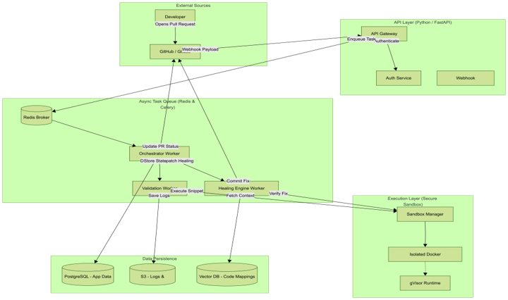
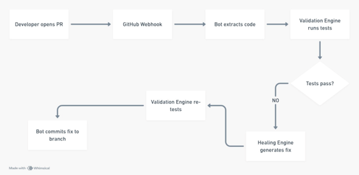

# OASIS: Self-Healing Documentation Engine

A GitHub/GitLab bot that treats documentation like code, ensuring technical accuracy without manual intervention.

## Overview

The Self-Healing Documentation Engine automatically validates code snippets in documentation during pull request workflows, detects breaking changes from function renames or dependency updates, and generates corrected versions that maintain Single Source of Truth documentation.

## Features

- **Automatic Validation**: Validates all code snippets in documentation on every pull request
- **Sandbox Execution**: Runs Python snippets in isolated subprocesses with timeout and memory limits
- **Auto-Correction**: AI-powered correction of broken code using Amazon Bedrock (Nova Pro + Claude 4 Sonnet)
- **Multi-Language Support**: Python, JavaScript, TypeScript, Java, Go, Ruby, Rust, C/C++, PHP, Bash
- **Hybrid Analysis**: Static analysis (AST/compile) + runtime execution + AI for deep code review
- **GitHub/GitLab Integration**: Seamless bot integration with status checks and comments
- **Code Mapping**: Intelligent tracking of relationships between code and documentation

## Architecture

The system is built as a cloud-native microservices architecture:



- **API Gateway**: FastAPI-based webhook handler and REST API
- **Validation Engine**: Sandbox execution (Python) + multi-language static analysis
- **Healing Engine**: 4-layer approach — static analysis → sandbox → Amazon Bedrock AI → diff scanning
- **Code Mapping Service**: AST-based code-documentation relationship tracking
- **Queue System**: Redis Queue (RQ) for reliable event processing
- **Database**: PostgreSQL for persistent storage
- **Cache**: Redis for caching and rate limiting

### Workflow



### Tech Stack

| Tech Layer | Technology | Purpose |
|-------|-----------|---------|
| API | Python 3.11 + FastAPI | Webhook handlers, REST API |
| Queue | Redis Queue (RQ) | Async task processing (3 queues) |
| AI | Amazon Bedrock (Nova Pro + Claude 4 Sonnet) | Code healing via `boto3` Converse API |
| Sandbox (Py) | `subprocess` + `ulimit` | Isolated Python execution (5s timeout, 50MB) |
| Sandbox (JS) | `node --check` | Fast JS/TS syntax validation |
| Database | PostgreSQL + SQLAlchemy | Persistent storage (9 tables, Alembic migrations) |
| Auth | HMAC-SHA256 | Webhook signature verification |
| Deployment | AWS ECS Fargate + ALB | Container orchestration |
| Secrets | AWS Secrets Manager | Credential management |
| CI/CD | GitHub Actions | Build → Test → Deploy |


### Interactive Judging / Live Testing

To test the OASIS bot live during the hackathon:
1. Fork this repository.
2. Edit `README.md` (or any markdown file) and add a code block with some intentional bugs.
3. Open a Pull Request from your fork back to this main repository.
4. Watch OASIS instantly analyze your PR, post a detailed comment with detected errors (using static analysis and Bedrock AI), and automatically commit a fix!

## Quick Start

### Prerequisites

- Python 3.11+
- Docker and Docker Compose
- Poetry for dependency management

### Installation

1. Clone the repository:
```bash
git clone <repository-url>
cd ai-doc-healing
```

2. Install dependencies:
```bash
poetry install
```

3. Start the services:
```bash
docker-compose up -d
```

4. Run database migrations:
```bash
poetry run alembic upgrade head
```

5. Start the API server:
```bash
poetry run uvicorn doc_healing.api.main:app --reload
```

### Lightweight Development Mode

For local development without Docker or heavy dependencies, run in lightweight mode using SQLite and an in-memory queue:

```bash
# Export configuration
export DOC_HEALING_DEPLOYMENT_MODE=lightweight
export DOC_HEALING_DATABASE_BACKEND=sqlite
export DOC_HEALING_QUEUE_BACKEND=memory
export DOC_HEALING_SYNC_PROCESSING=true

# Or use the make command
make dev-lightweight
```

### Deployment Modes Comparison

| Feature | Full Production | Lightweight | Hybrid |
|---------|-----------------|-------------|--------|
| **Database** | PostgreSQL | SQLite | SQLite |
| **Queue** | Redis | In-Memory | Redis |
| **Workers** | Multiple Containers | Thread Pool / Sync | Single Process |
| **Memory Target** | ~2GB | < 500MB | ~1GB |
| **Setup Time** | High (Docker) | Low (Native) | Medium |
| **Docker Required** | Yes | No | Optional |

### Running Tests

```bash
# Run all tests
poetry run pytest

# Run with coverage
poetry run pytest --cov=src/doc_healing

# Run specific test types
poetry run pytest -m unit
poetry run pytest -m property
poetry run pytest -m integration
```

### Code Quality

```bash
# Format code
poetry run black src tests

# Lint code
poetry run ruff check src tests

# Type checking
poetry run mypy src
```

## Configuration

Create a `.doc-healing.yml` file in your repository root:

```yaml
enabled: true

documentation:
  include:
    - "docs/**/*.md"
    - "README.md"
  exclude:
    - "docs/archive/**"

languages:
  python:
    enabled: true
    timeout: 30
    dependencies:
      - "requests"
      - "pytest"

validation:
  autoCorrect: true
  confidenceThreshold: 0.8
  blockOnFailure: true
```

## Development

### Project Structure

```
.
├── src/doc_healing/          # Main application code
│   ├── api/                  # FastAPI application & landing page
│   ├── db/                   # Database models and configuration
│   ├── llm/                  # Static analyzer, sandbox, Bedrock AI
│   ├── models/               # Shared data models
│   ├── monitoring/           # Performance/Memory monitoring
│   ├── queue/                # Queue management (Redis + in-memory)
│   └── workers/              # Task processing (webhook, validate, heal)
├── tests/                    # Test suite
├── scripts/                  # Data migration scripts
├── alembic/                  # Database migrations
├── deploy/                   # AWS deployment configs
├── docker-compose.yml        # Full production setup
├── docker-compose.lightweight.yml # Lightweight setup
└── pyproject.toml           # Project dependencies
```

## License

[Add your license here]

## Contributing

[Add contributing guidelines here]
